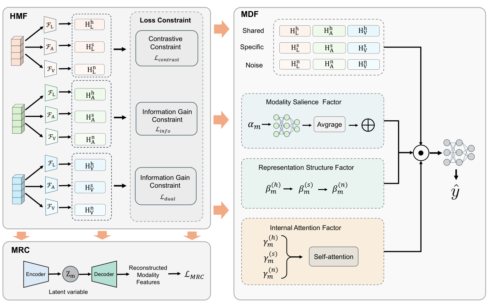

# FUSE-Net

**Factorize, Reconstruct, Enhance: A Unified Framework for Multimodal Sentiment Analysis**

FUSE-Net models sentiment from language, visual, and acoustic signals by separating shared, modality-specific, and noise representations, regularizing them through variational reconstruction, and combining them with adaptive factor weights.

[Paper (PDF)](docs/paper/FUSE-Net.pdf) · [Data preparation](docs/DATA.md) · [Implementation review](docs/REPRODUCIBILITY.md) · [Source manifest](docs/source_manifest.json)

> **Research snapshot · private development.** The supplied implementation and manuscript are archived here. The numbers below are transcribed from the manuscript; they have not been reproduced from this snapshot. Checkpoints, datasets, experiment logs, and the original environment lockfile were not supplied. Known training and evaluation issues are documented in the implementation review.

## Method



| Component | Purpose | Implementation |
| --- | --- | --- |
| **HMF — Hierarchical Modality Factorization** | Split each modality into shared, specific, and noise factors; apply contrastive, auxiliary prediction, and dual consistency objectives. | [`FUSENet/models.py`](FUSENet/models.py), [`FUSENet/solver.py`](FUSENet/solver.py) |
| **MRC — Modality Reconstruction Channel** | Reconstruct the projected modality representation through a variational latent channel. | `mrc_encoders`, `mrc_decoders`, `compute_mrc_loss` |
| **MDF — Multi-factor Dynamic Fusion** | Compute sample-conditioned branch weights, gate the noise branch, and aggregate factors for sentiment regression. | `alpha_mlp`, `attn_mlp`, `gate_linear`, `fuse_mlp` |

The figure is taken directly from the manuscript. See the implementation review for differences between the figure, manuscript description, and executable code.

## Reported results

**Source: Tables 1–2 of the [supplied manuscript](docs/paper/FUSE-Net.pdf). These are paper-reported results, not validation results for this repository.** Accuracy and F1 are percentages; MAE and correlation are unscaled. The manuscript states that results are averaged over five seeds; the supplied entry point fixes one seed, `42`.

### CMU-MOSI and CMU-MOSEI

| Dataset | MAE ↓ | Corr ↑ | Acc7 ↑ | Acc2 ↑ | F1 ↑ |
| --- | ---: | ---: | ---: | ---: | ---: |
| CMU-MOSI | 0.688 | 0.798 | 49.27 | 83.53 / 85.83 | 83.75 / 85.96 |
| CMU-MOSEI | 0.527 | 0.772 | 54.32 | 84.52 / 85.88 | 84.50 / 86.14 |

For each pair, the left value uses non-negative versus negative labels; the right value uses positive versus negative labels with zero-valued targets excluded.

### SIMSv2

| Dataset | MAE ↓ | Corr ↑ | Acc2 ↑ | Acc3 ↑ | Acc5 ↑ | F1 ↑ |
| --- | ---: | ---: | ---: | ---: | ---: | ---: |
| SIMSv2 | 0.297 | 0.712 | 79.59 | 73.69 | 55.51 | 79.53 |

The code exposes `ch-sims`, but its dataset version, unaligned sequence handling, and discretization need reconciliation with SIMSv2 before this row can be reproduced. No equivalence between CH-SIMS and SIMSv2 is assumed.

## Repository layout

| Path | Contents |
| --- | --- |
| [`FUSENet/`](FUSENet/) | Canonical source snapshot from the supplied ZIP, preserved byte for byte. Start here. |
| [`FUSENet/train.py`](FUSENet/train.py) | Training entry point; validation selection and final test evaluation. |
| [`FUSENet/config.py`](FUSENet/config.py) | CLI options and dataset paths. |
| [`FUSENet/create_dataset.py`](FUSENet/create_dataset.py), [`FUSENet/data_loader.py`](FUSENet/data_loader.py) | Dataset construction, cached samples, tokenization, and batching. |
| [`docs/paper/FUSE-Net.pdf`](docs/paper/FUSE-Net.pdf) | Original supplied manuscript, with a filesystem-friendly filename. |
| [`docs/DATA.md`](docs/DATA.md) | Expected files, schemas, and preprocessing assumptions. |
| [`docs/REPRODUCIBILITY.md`](docs/REPRODUCIBILITY.md) | Confirmed implementation issues, manuscript discrepancies, and validation scope. |
| [`requirements.txt`](requirements.txt) | Direct dependency inventory; not a recovered experimental lockfile. |
| [`scripts/check_repository.py`](scripts/check_repository.py) | Standard-library-only source integrity, syntax, and local documentation checks. |
| [`fusenetpp/`](fusenetpp/), root-level Python files | Pre-existing experimental code retained from this repository; outside the canonical uploaded snapshot. |

Use `python FUSENet/train.py ...` from the repository root. The older root-level `train.py` is not the documented entry point and has a different configuration path/import layout.

## Environment setup

The historical package versions were not included. The commands below prepare dependencies for inspecting and developing the source; successful installation alone does not establish reproduction of the paper.

```bash
git clone https://github.com/ada-zy2425/FNroot.git
cd FNroot
python3 -m venv .venv
source .venv/bin/activate

# Install the PyTorch build appropriate for your CUDA environment, then:
python -m pip install -r requirements.txt

# The source imports mmsdk at module load time, even for cached datasets.
git clone https://github.com/CMU-MultiComp-Lab/CMU-MultimodalSDK.git
python -m pip install -e ./CMU-MultimodalSDK
```

SDK installation follows the [upstream instructions](https://github.com/CMU-MultiComp-Lab/CMU-MultimodalSDK#-installation). Record the SDK revision and installed package versions when establishing a reproducible environment.

**The supplied training loop currently requires CUDA:** `utils/convert.py` calls `.cuda()` unconditionally. CPU/MPS training has not been implemented in this snapshot. The default text encoder is `roberta-large`; its model and tokenizer must be available locally or downloadable. No pretrained weights are bundled.

## Inspect and run

First run the repository checks, which need no ML dependencies or dataset downloads:

```bash
python scripts/check_repository.py
```

Then prepare the data using [DATA.md](docs/DATA.md). After installing dependencies, inspect the available options:

```bash
python FUSENet/train.py --help
```

The existing MOSI/MOSEI entry points are:

```bash
python FUSENet/train.py --data mosi --bert_dir roberta-large
python FUSENet/train.py --data mosei --bert_dir roberta-large
```

These show the actual CLI, **not a validated reproduction recipe**. Resolve the loss and variational sampling issues in the [implementation review](docs/REPRODUCIBILITY.md) before starting a benchmark run. Missing MOSI/MOSEI caches trigger SDK dataset construction and may start downloads.

The implementation prints test metrics after restoring the best validation weights **in memory**. It does not currently save checkpoints or machine-readable results, and there is no standalone checkpoint evaluation command.

### Defaults in the supplied source

| Setting | Default |
| --- | --- |
| Text encoder | `roberta-large` |
| Visual/acoustic encoder | One-layer bidirectional GRU |
| Hidden size / dropout | `128` / `0.4` |
| Batch size / maximum epochs | `64` / `100` |
| Optimizer | AdamW |
| Encoder / other learning rate | `1.5e-5` / `3e-5` |
| Weight decay / gradient clipping | `0.01` / `1.0` |
| Scheduler / early stopping | ReduceLROnPlateau / validation MAE, patience `10` |
| Seed | `42`, fixed in `train.py` |
| Task / contrastive / information-gain weights | `1.0` / `0.1` / `0.25` |
| Dual consistency / reconstruction / VIB weights | `0.02` / `0.015` / `0.01` |
| Siamese noise weight | `0.0` |

These are code defaults, not independently confirmed settings behind the manuscript tables. `warmup_steps` is parsed but not used. The non-transformer text path and the extra `ur_funny`/`iemocap` configuration names are not supported by a complete data pipeline.

## Paper and attribution

The supplied paper is **Factorize, Reconstruct, Enhance: A Unified Framework for Multimodal Sentiment Analysis**, by **Zhilu Yang and Mingcheng Li**. The PDF is preserved as received. Publication venue, acceptance status, DOI, and final bibliographic metadata have not been independently verified; no venue badge or proceedings citation is asserted here.

For an internal manuscript reference:

```bibtex
@unpublished{yang_fusenet,
  title  = {Factorize, Reconstruct, Enhance: A Unified Framework for Multimodal Sentiment Analysis},
  author = {Yang, Zhilu and Li, Mingcheng},
  note   = {Author-provided manuscript; see the accompanying PDF}
}
```

The snapshot has no project-wide license file. Existing third-party attributions are recorded in [THIRD_PARTY_NOTICES.md](THIRD_PARTY_NOTICES.md); a public release needs an explicit license decision and a completed provenance review.
